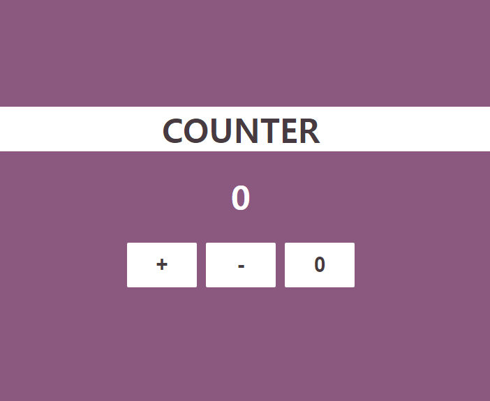

# COUNTER
A simple counter app made with vanilla js

## Preview

## REQUIREMENTS
- [x] `Counter` 클래스를 별도의 파일 모듈로 만들어 import/export 사용
- [x] 화면에 표시되는 카운터는 클래스의 인스턴스를 생성해서 표시
- [x] 숫자: 현재 카운터 값
- [x] 버튼: 증가, 감소, 리셋

## BONUS

- [x] '카운터 추가' 버튼으로 카운터를 원하는 만큼 추가할 수 있다.(인스턴스 여러 개 생성)
- [x] 여러 개의 카운터는 각각 별도로 카운팅 된다.
- [x] 로컬 스토리지에 현재 카운터의 개수와 각 카운터의 숫자 값을 저장한다.
